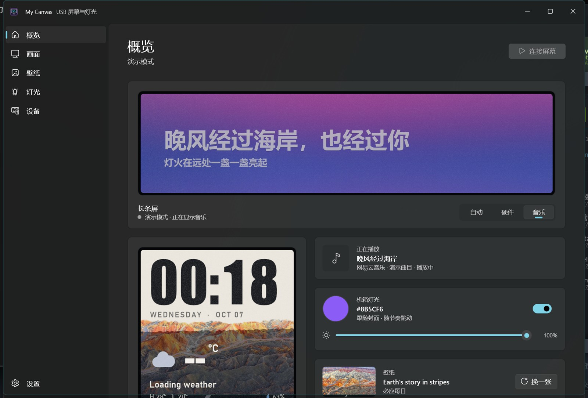
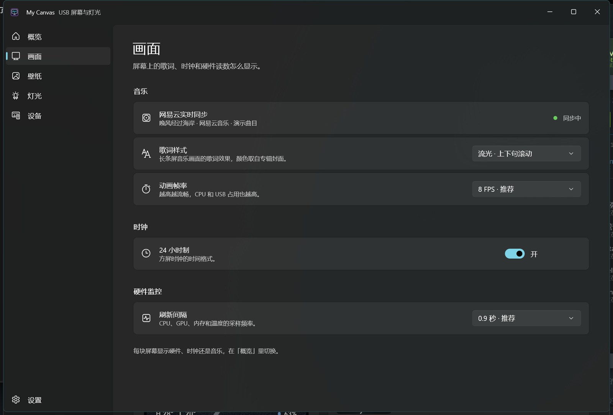
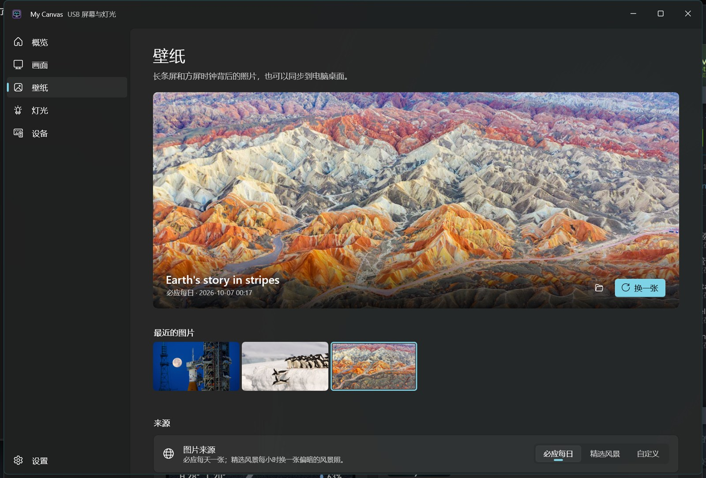
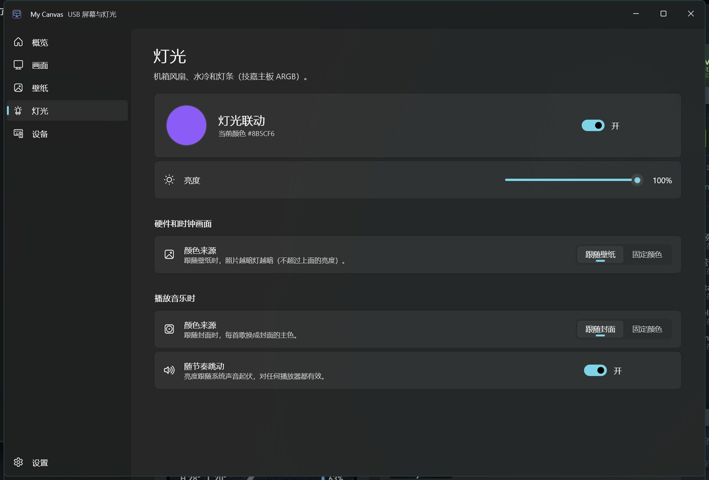
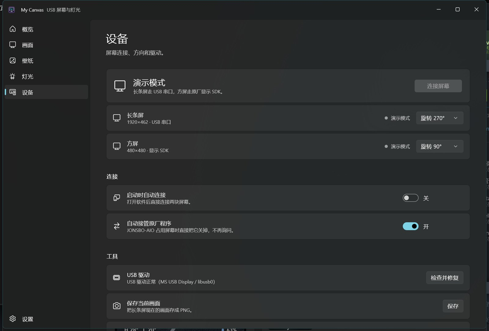
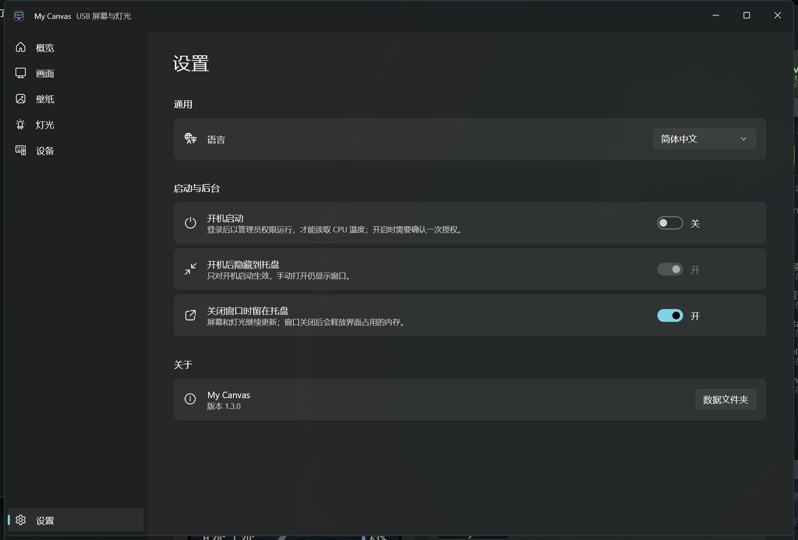
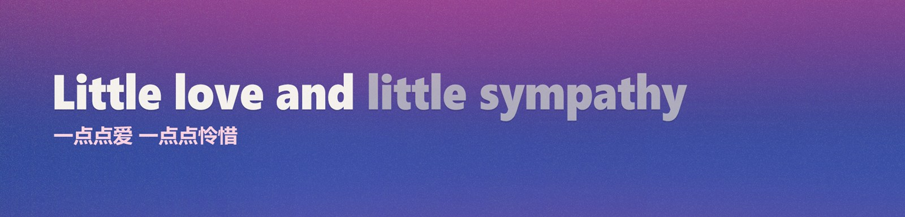
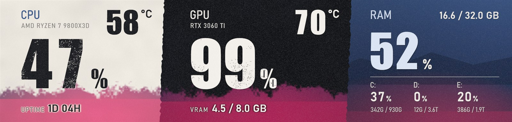
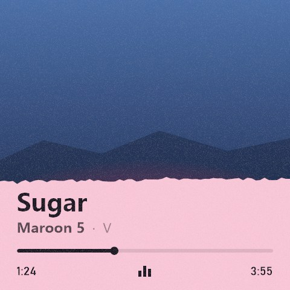
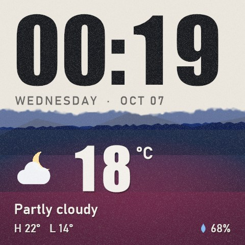

# My Canvas · 双屏定制基础版

基于 [ZhouhaoJiang/JonsboCanvas](https://github.com/ZhouhaoJiang/JonsboCanvas) 的本地定制版本。程序把一块 1920 × 462 的长条屏和一块 480 × 480 的方屏当成两块独立画面来驱动，并提供一个 Windows 控制界面，用来决定每块屏幕显示什么、用哪张壁纸，以及机箱灯光怎么跟随。源码版本号见 `source/JonsboCanvas.WinUI/JonsboCanvas.WinUI.csproj`，应用内显示在「设置 → 关于」。

## 截图

### 控制界面

**概览**：两块屏幕的在线状态、当前显示的内容、正在播放的歌曲、机箱灯光和壁纸。



**画面**：屏幕上歌词、时钟和硬件读数怎么显示——网易云实时同步、歌词样式、动画帧率、时钟进制和硬件刷新间隔。



**壁纸**：来源可选必应或精选风景；精选提供风景、动漫、赛博朋克、抽象、建筑五种风格，也可以自定义关键词；照片还能同步为 Windows 桌面壁纸和主题色。



**灯光**：机箱风扇、水冷和灯条的颜色来源——硬件和时钟画面可以跟随壁纸，播放音乐时可以跟随专辑封面，也可以固定或自定义颜色；下面是亮度，以及让亮度随节奏跳动。



**设备**：两块屏幕的连接状态和方向、启动时自动连接、接管原厂程序、USB 驱动检查修复，以及把当前长条屏画面保存成 PNG。



**设置**：语言、开机启动、隐藏到托盘、关闭窗口后是否继续后台运行，以及版本和数据文件夹。



### 两块屏幕的输出

长条屏 1920 × 462，从上到下分别是音乐画面和硬件画面：





方屏 480 × 480，从左到右分别是音乐画面和硬件画面：





## 目录

```
MyCanvas\
  app\       正在使用的软件（唯一版本）；app\data 是配置、壁纸缓存和日志
  docs\screenshots\  README 用到的界面和屏幕截图
  source\    源码
    publish.ps1   编译并发布到 app\，然后重启（加 -Test 先跑测试）
    tools\        自带的 .NET SDK 和 NuGet 包，编译不依赖系统环境
    docs\         上游说明、双屏测试记录、机箱灯光协议研究资料
    test-output\  渲染测试输出的预览图
```

桌面快捷方式 `MyCanvas` 和开机自启计划任务都指向 `app\MyCanvas.exe`，数据目录为 `app\data`。灯光日志在 `%LocalAppData%\MyCanvas\lighting.log`。

## 使用

双击桌面的 `MyCanvas`，或在 `app` 里双击 `双击启动正式版.cmd`。程序自带 .NET 和 Windows App SDK 运行时，无需另行安装。启动入口把配置、日志和运行资源放在同目录的 `data` 文件夹。

- 长条屏：1920 × 462，通过 VID_33C3/PID_F101 的串口传输 JPEG，自动识别 COM 端口，使用实机确认的 270° 旋转。
- 方屏：480 × 480，通过 MS USB Display SDK，追加并选择 480 × 480 显示模式，使用实机确认的 90° 旋转。
- 左侧菜单共六页：概览、画面、壁纸、灯光、设备、设置。
- 「概览」分别选择长条屏和方屏当前显示硬件、时钟还是音乐，并显示在线状态、正在播放的歌曲和当前灯光颜色。
- 「画面」设置歌词样式、动画帧率和硬件采样间隔。
- 「壁纸」选择图片来源和风格，决定是否同步到 Windows 桌面壁纸和主题色。
- 「灯光」决定机箱灯光的开关、两段颜色来源（硬件和时钟画面、播放音乐时）以及亮度。
- 「设备」报告两块屏幕的连接状态，可连接或断开，并提供驱动检查修复和长条屏画面保存。
- 自动接管开启时，连接前退出 JONSBO-AIO，避免争用屏幕；关闭后，自动连接遇到原厂占用会等待手动处理。
- 默认不开启开机启动。开启后使用定制版专属计划任务，保留当前配置目录。
- 关闭窗口默认隐藏到托盘。彻底退出请从托盘菜单选择退出。

普通权限实机运行时已读到 CPU 占用、内存和 GPU 数据，但 CPUID 未提供 CPU 温度（初始化日志为 result=0、error=5）。若需要重试传感器访问，先从托盘退出程序，再运行 `管理员启动.cmd` 并自行处理 Windows 权限提示。管理员方式的温度读取尚未验证，不保证一定解决。

直接运行 MyCanvas.exe 时默认使用 `%LocalAppData%\MyCanvas`；需要指定数据目录可传入 `--data-dir="目录"`。

## 当前设计

控制端是 WinUI 应用，左侧六个页面。长条屏按原比例显示上游画面并新增右侧信息区，方屏提供独立的方形布局。每块屏幕显示硬件、时钟还是音乐都能独立切换，壁纸、歌词样式和灯光颜色来源也都能单独设置。原有网易云实时同步与额度数据采集保留，音乐首次同步仍需按界面提示操作。

## 验证

- 此前独立测试程序已经完成实机方向校准，用户确认两块屏幕都正常。
- 定制 WinUI 程序报告 2/2 连接，运行日志记录两条通道持续发送成功。
- 渲染与策略检查共 63 项通过，覆盖配置持久化与恢复、端口匹配、JPEG 尺寸与方向、内容布局、音乐进度单位、独立帧去重、壁纸颜色取光和灯光跟随。
- 上游序列化、渲染节奏、托盘和唤醒策略回归检查通过。
- 发布构建通过；上游旧代码仍有可空性及旧网络 API 警告。

尚未进行长时间压力测试、高帧率动画测试和拔插/睡眠唤醒实机测试。串口音乐输出暂时独立限速 5 FPS，USB 音乐帧率按原项目设置。

## 源码与构建

主要新增代码位于 `source/JonsboCanvas.WinUI/Core/SerialJpegDisplay.cs`、`DualDisplayController.cs`、`DualLayoutRenderer.cs`。主界面、配置、嵌入运行时和 USB 控制代码做了相应修改。

厂商二进制以压缩形式存放：`cpuidsdk.dll` 在仓库里是 `cpuidsdk.dll.gz`，程序启动时解压到运行目录；`build.cmd` 和 WinUI 工程的嵌入资源都已改为引用压缩包。

用 `source\tools` 里自带的 .NET 10 SDK 构建。一条命令完成测试、发布到 `app\` 并重启：

```powershell
.\source\publish.ps1 -Test
```

源码在 [github.com/birdmichael/my-canvas](https://github.com/birdmichael/my-canvas)。上游仓库与原有第三方说明保留；原始项目授权说明见 `source/docs/UPSTREAM-README.md`，第三方二进制说明见 `source/JonsboCanvas.WinUI/THIRD-PARTY-NOTICES.md`。

## 网易云兼容修复

3.1.40 客户端使用共享 SDK 的播放事件订阅，保留播放器原有回调；优先连接主播放窗口，避免把桌面歌词窗口当成数据源。重连复用订阅，并更新传输绑定。兼容新版三参数播放状态，保留旧版两参数格式。实机已验证歌曲、歌词、持续进度和程序重启后恢复同步。额外的 JavaScript 回归检查运行：node .\source\MyCanvas.Tests\playback-bridge.test.cjs。

